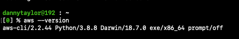

# **Configuring the AWS CLI.**

First start by installing the AWS CLI on whichever OS you're working on, in my example I will be using Mac on my personal laptop.

Once installed, we can verify using the following command:



We can then use:

```
aws configure
```

To configure our AWS IAM role using the Access & Secret Access Keys that we have generated from the console. I have specified my region as eu-west-2 & my output response from the console as json.

We can then test if this was a success by running a simple command such as:

```
aws iam list-users
```

And we should see a list of our AWS users.