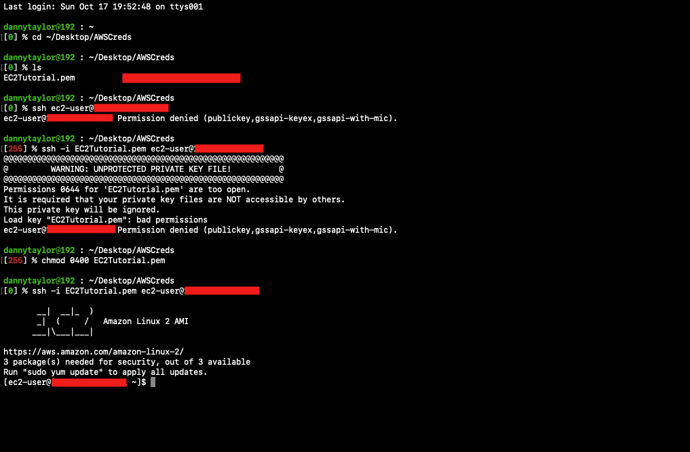

# **SSH.**

SSH stands for **Secure Shell**.

SSH allows you to control a remote machine, all from the command line of your own physical machine.

Based on the hardware's OS, we have different ways to SSH into our virtual instance:

**SSH can only be used on Mac & Linux, as well as windows machines that use Windows 10 or higher.**

Windows machines that use a version of Windows less than Windows 10, cannot use SSH to connect to their instance - in this case, something called **Putty** is used (any version of windows).

There is also something called the EC2 Instance Connect in the web browser (this is new), which can be used with all types of OS's (but only connects to linux/ubuntu VM's).

## **SSH Configuration (Mac/Linux).**

Remember, SSH connects to an EC2 instance through port 22 through the web.

When setting up an EC2 instance that we want to control from our own machine, we can set up a key pair name to SSH into the machine, recall previously, we set up our EC2 instance to have the 'EC2Tutorial' SSH authenticator.

This gave us a .pem file with our access SSH credentials to access our EC2 instance, we can then access our EC2 instance from our terminal as follows:



**A very common exam question is displayed above regarding the 0644 error code.\***

The 0644 error code for the .pem file is a very common exam question, here, the file isn't sufficiently protected. Here, the SSH private key can leak, which could be very problematic.

**To fix this, run the following command:**

```
chmod 0400 <.pem_filename>
```

Before running the:

```
ssh -i <.pem_filename> <ec2_username>@<public_ipv4_address>
```

Commands again - the public Ipv4 address can be found from the console.