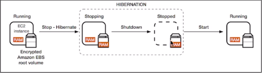

# **EC2 Hibernate.**

* We know we can stop & terminate our EC2 instances.
    * Stop - the data on disk (EBS) is kept intact in the next start.
    * Terminate - any EBS volumes (root) also set-up to be destroyed is lost.

* On start, the following happens:
    * First start - OS boots up & bootstrap script is ran.
    * Following starts - OS boots up.
    * Application starts, cache gets warmed up - this can take time!

To combat this, we can use EC2 Hibernate. Once we set our EC2 instance to hibernate, on next start\*:

* The in-memory (RAM) is preserved.
* The instance boot is much faster (as the OS hasn't stopped).
* The RAM state is written to a file in the root EBS volume.
* The root EBS volume must be encrypted.

Below is a diagram to demostrate at a very high level how hibernate deals with the in-memory (RAM) of a running instance:

Use Cases:

* Long-running processes.
* Saving the RAM state.
* Services that take a long time to initialise.

### **Good to Know's.**

* Does not support all the EC2 instance families/types.
* Instance RAM size must be less than 150 GB.
* Only supports Amazon Linux 2, Linus AMI, Ubuntu & Windows AMI's.
* EC2 instance must use EBS, be encrypted & large enough to store the RAM.
* Not supported for 'bare metal instances'.
* Available only for On-Demand & Reserved instances - not for Spot instances.
* An instance cannot be hibernated for more than 60 days.