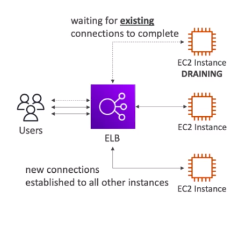

# **Connection Draining.**

This can have two names:

* Classic load balancer - Connection Draining.
* Application / Network load balancer - Deregistration Delay.
* These will give the instance time to complete "in-flight requests" while the instance is de-registering or unhealthy.
* Stops sending new requests to the EC2 instance which is de-registering.
* These can be set to anywhere between 1-3600 seconds.
* Can also be disabled (by setting the value to 0).
* Set a low value if your requests are short.

