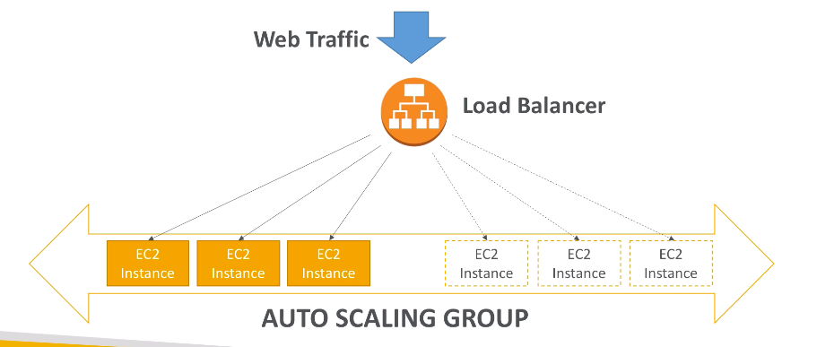

# **Auto Scaling Groups.**

In real life, the load on your websites and applications can change. In the cloud, you can create and get rid of servers very quickly.

The goal of an Auto Scaling Group (ASG) is to:
* Scale out (add EC2 instances) to match an increased load.
* Scale in (remove EC2 instances) to match a decreased load.
* Ensure we have a minimum and maximum number of machines running.
* Automatically register new instances to a load balancer.

## **Auto Scaling Groups in AWS.**

An Auto Scaling group in AWS might look something a little like this:

Auto Scaling Groups have the following attributes:

* A launch config. consisting of:
    * AMI + Instance type.
    * EC2 user data.
    * EBS volumes.
    * Security groups.
    * SSH key pair.
* Min size / Max size / Initial capacity.
* Network + Subnets info.
* Load Balancer info.
* Scaling policies.

## **Auto Scaling Alarms.**

* It is possible to scale an ASC based on Cloudwatch alarms.
* Cloudwatch alarms monitor metrics allowing us to scale out & in (though policies).
* The metrics can range from anything you want, from average CPU usage to Network input.
* Metrics are computed for the overall ASG instances.

Potential Cloudwatch Alarms for EC2 / ASG:

* Target average CPU usage.
* Number of requests on the ELB per instance.
* Average network in / out.

These rules are easy to configure.

**We can also define a custom metric (e.g. # of connected users) to use in our Cloudwatch alarm.**

This is done by:

* Creating an in-app custom metric using the (PutMetric API) and send this from EC2 to Cloudwatch.
* Configuring Cloudwatch Alarms in response to these.
* These will in turn trigger the scaling policies.

## **ASG Cheat Sheet.**

* Scaling policies can be based on any metrics (either pre-defined or custom).
* ASG's can use Launch Templates (or Launch Configurations).
* To update an ASG, you must provide a new launch configuration / template.
* IAM roles attached to an ASG will get assigned to EC2 instances.
* ASG's are free. You pay for the underlying hardware costs and usage of the EC2 instances being launched.
* Having instances under an ASG means that if they get terminated for any unknown reason, the ASG will automatically create new ones as a replacement. Giving us extra safety features.
* ASG's can terminate instances marked as unhealthy by a Load Balancer (& thus replcase them!).