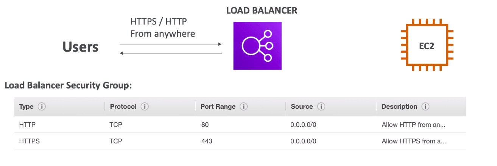
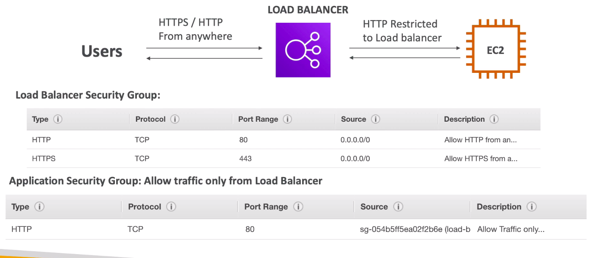

# **ELB.**

**ELB stands for Elastic Load Balancing.**

## **What is load balancing?**

* Load Balancers are servers that forward traffic to multiple servers (e.g. EC2 instances) downstream.

## **Why use a load balancer?**

* Spread load across multiple downstream instances.
* Expose a single point of access (DNS) to your application.
* Seamlessly handle failures of downstream instances.
* Do regular health checks to your instances.
* Provide SSL termination (HTTPS) for your websites.
* Enforce stickiness with cookies.
* High availability across zones.
* Seperate public traffic from private traffic.

## **Why use an Elastic Load Balancer?**

* An Elastic Load Balancer is a **managed load balancer**:
    * AWS guarentees that it will be working.
    * AWS takes care of upgrades, maintenance & high availability.
    * AWS provides only a few configuration customisations.

* **It costs less to setup your own load balancer but it will be a lot more effort on your end.**
* It is integrated with many AWS offerings & services such as:
    * EC2, EC2 Auto Scaling Groups, Amazon ECS.
    * AWS Certificate Manager, Cloudwatch.
    * Route 53, WAF, Global Accelerator.

## **Health Checks.**

* These atre crucial for Load Balancers.
* They enable the load balancer to know if instances it forwards traffic to are available to reply to requests.
* They are done on a port and a route (/health is common).
* i.e. we can check via HTTP on port 4567 with an endpoint "/health" if our EC2 instance is available.
* A HTTP 200 response indicates an instance is healthy.

## **Types of load balancer on AWS.**

AWS has 4 kinds of load balancer.

* **Classic Load Balancer** - v1 old gen. - CLB.
    * Supports HTTP, HTTPS, TCP, SSL (secure TCP).
* **Application Load Balancer** - v2 new gen. - ALB.
    * Supports HTTP, HTTPS, WebSocket.
* **Network Load Balancer** - v2 new gen. - NLB.
    * TCP, TLS (secure TCP), UDP.
* **Gateway Load Balancer** - GWLB.
    * Operates at layer 3 (Network layer) - IP Protocol.

It is recommended to use the newer generation load balancers as they provide more features.
* Some load balancers can be setup as internal or external ELBs.

## **Load Balancer Security Groups.**

* Users need HTTP or HTTPS access from anywhere (equivalent to source range 0.0.0.0/0 i.e. any IP address), so our Load Balancer security group may look something like the below (on a very basic level).

**Recall port specifications for different types of access protocols in 3.3).**

* However, our EC2 instances should only allow traffic directly from the load balancer.
* Thus, our EC2 instance security group may look something like the below (on a basic level).

**Notice how the source for the EC2 security group is the ID of the Load Balancer Security Group.**