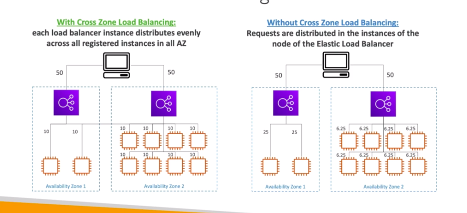

# **Cross-Zone Load Balancing.**

With cross-zone load balancing, each load balancer instance distributes evenly across all registered instances in all AZ's.

Without cross-zone load balancing, the requests are distributed in the instances of the node of the load balancer.

The below slide may help explain this behaviour a little better.

* **For the application load balancer, this feature is always on & cannot be disabled. You also incur no charges for inter-AZ data transfer.**

* **For the network load balancer, this feature is disabled by default. You will incur extra charges for inter-AZ data transfer if enabled.**

* **For the classic load balancer, this feature is again disabled by default. However, you incur no extra charges for inter-AZ data transfer if you enable this feature.**