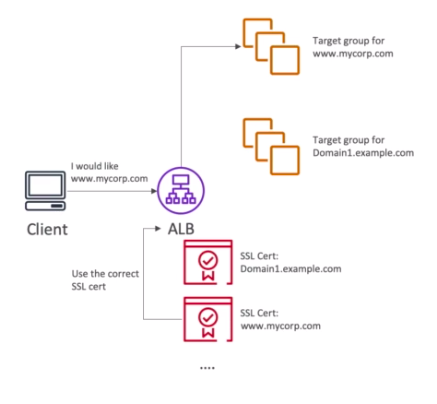

# **SSL & TSL Basics.**

*This is only the basics...*

* An SSL Certificate allows traffic between your clients and your load balancer to be encrypted in transit (in-flight encryption).
* SSL refers to **Secure Sockets Layer**, used to encrypt connections.
* TLS refers to **Transport Layer Security**, which is a newer version of SSL.
* It is more common to see TLS certificates in todays world.
* Public SSL certificates are issued by Certificate Authorities (CA's), such as: Comodo, GoDaddy, Symantec etc.
* SSL certificates have an expiration date that you can set and need to be renewed.

This means that a client can access our Load Balancer over HTTPS (S for SSL Secure), the load balancer will then implement a feature called "SSL Termination" where it will drop the SSL certificate and communicate with / redirect the client to the EC2 instance over HTTP.

On the surface this looks unsecure, but the EC2 instance will still be within our Virtual Private Cloud (VPC), so data should be secure.

* The load balancer uses an X.509 certificate (SSL/TLS server certificate).
* You can manage certificates using ACM (AWS Certificate Manager).
* You can upload your own certificates alternatively.
* When you set a HTTPS listener for your load balancer:
    * Specify a default certificate.
    * You can add an optional list of certs to support multiple domains.
    * Clients can use Server Name Indication (SNI) to specify the hostname they reach.
    * Ability to specify a security policy to support older versions of SSL / TLS.

## **Server Name Indication.**

* SNI solves the problem of loading multiple SSL certificates onto one web server (to serve multiple websites).
* It's a "newer" protocol and requires the client to indicate the hostname of the target server in the initial SSL handshake.
* The server will then find the correct certificate or return the default one.
* To note:
    * Only works for ALB's, NLB's & CloudFront.
    * Does not work for CLB's.

## **SSL Certificates.**

* Classic Load Balancer:
    * Supports only one SSL certificate.
    * Must use multiple CLB for multiple hostname with multiple SSL certificates.
* Application Load Balancer:
    * Supports multiple listeners with multiple SSL certificates.
    * Uses SNI to make it work.
* Network Load Balancer:
    * Supports multiple listeners with multiple SSL certificates.
    * Uses SNI to make it work.