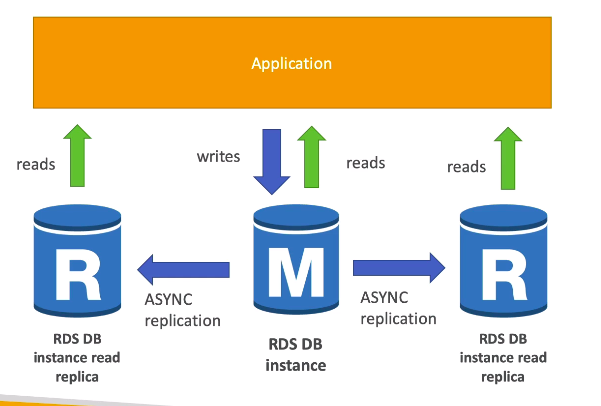

# **RDS Read Replicas for Read Scalability.**

Read replicas help us scale the amount of reads on our databases.

* We can create up to 5 read replicas.
* These can be within the same AZ, across AZ or cross region.
* Replication is **ASYNC** so reads are eventually consistent.
* Replicas can be promoted to their own database.
* Applications must update the connection string to leverage read replicas.

This may look something like the below:

## **Read Replicas - Use Cases.**

* You have a production database that is taking on normal load.
* You have a new team that wants to run reporting & applications on top of that data for some analytics.
* You can thus create a Read Replica to run the new workload there.
* The production application is completely unaffected.
* Read Replicas are ONLY used for SELECT statement (i.e. read), not INSERT, UPDATE, DELETE etc.

## **RDS Read Replicas - Network Costs.**

* In AWS, there's usually a network cost when data goes from one AZ to another.
* For RDS Read Replicas within the same region, you don't pay that fee (i.e. eu-west-2a into eu-west-2b).
* However, cross-region asynchronous replication (i.e. us-east-1a into eu-west-1b) does have a cost.

## **RDS Multi AZ (Disaster Recovery).**

* SYNC replication (i.e. instant).
* One DNS name - automatic app failover to standby.
* This increases our availability.
* Failover in case of loss of AZ, loss of network, instance or storage failure.
* No manual intervention in apps.
* Not used for scaling, just used for failover.
* NOTE - The Read Replicas can be setup as Multi AZ for Disaster Recovery.

## **RDS - From Single-AZ to Multi-AZ.\***

* Zero downtime operation (no need to stop the DB).
* Just click on "modify" for the database.
* The following happens internally:
    * A snapshot of your DB is taken.
    * A new DB is restored from the snapshot in a new AZ.
    * Synchronisation is established between the two databases.