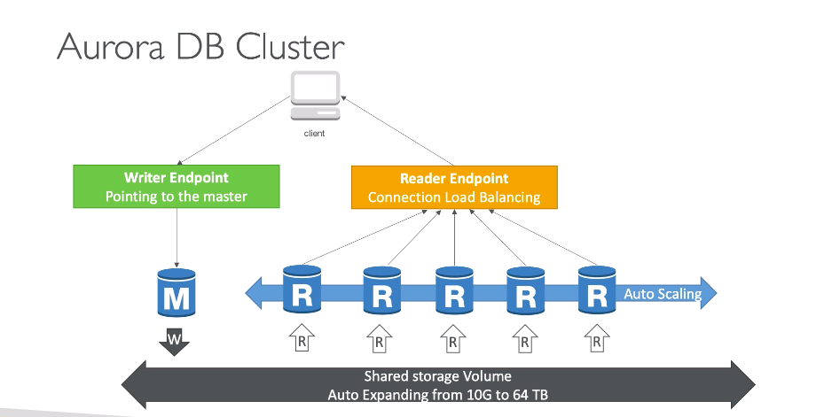

# **Aurora Overview.**

* Aurora is a proprietary technology from AWS (i.e. it is not open-sourced).
* Postgres and MySQL are both supported as Aurora DB (that means your drivers will work as if Aurora was a Postgres or MySQL database).
* Aurora is "AWS Cloud Optimized" & claims 5x performance improvement over MySQL on RDS, over 3x the performance of Postgres on RDS.
* Aurora storage automatically grows in increments of 10GB, up to 128 TB.
* Aurora can have 15 replicas whilst MySQL can only have 5, the replication process is also much faster (sub 10 ms replica lag).
* Failover in Aurora is instantaneous.
* Aurora costs 20% more than RDS but is much more efficient.

## **High Availability and Read Scaling.**

* Aurora copies 6 copies of your data across 3 AZ's/
    * Only needs 4 copies out of 6 for writes.
    * Only needs 3 copies out of 6 for reads.
    * Self healing with peer-to-peer replication.
    * Storage is striped across 100's of volumes.
* **One Aurora Instance takes writes (master).**
* Automated failover for master in less than 30 seconds.
* Master + up to 15 Aurora Read Replicas to serve reads.
* Support for Cross Region Replication.

## **Aurora DB Cluster.**

* Master is the only instance that writes to storage.
* As master can failover, Aurora provides a **Writer Endpoint** (basically just a DNS name) that points to the master.
* There is also something that is called a **Reader Endpoint** (this works as a load balancer - see diagram below).

## **Features of Aurora.**

* Automatic fail-over.
* Backup & recovery.
* Isolation & security.
* Industry compliance.
* Push-button scaling.
* Automated patching with zero downtime.
* Advanced monitoring.
* Routine maintenance.
* Backtrack - restore data at any point of time without using backups.

## **Security.**

* Similar to RDS as it uses the same engines.
* Encryption at rest using KMS.
* Automated backups, snapshots & replicas are also encrypted.
* Encryption in flight using SSL (same as MySQL or Postgres).
* Possible to authenticate using IAM token.
* You are responsible for protecting the instance with security groups.
* Cannot SSH into the instance.