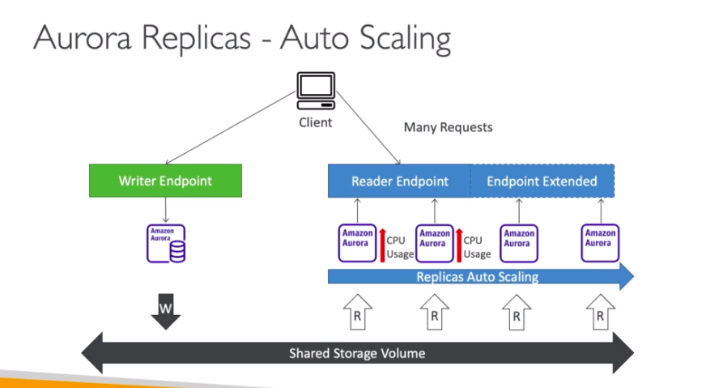
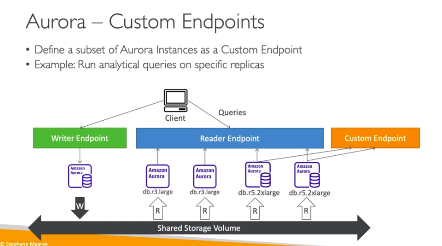

# **Aurora Advanced Concepts.**

## **Auto Scaling.**

* If the reader endpoint is processing or experiencing large numbers of requests, we can auto-scale our reader instances horizontally (i.e. add more to deal with that demand).

## **Custom Endpoints.**

* We can have different Aurora instance types or sizes.
* Let's envision that we have 2 out of 4 reader instance types that are larger than the others.
* We can assign those two read instances a custom endpoint to utilise the performance of those instances on the shared volume.
* Generally, the reader endpoint is not used after defining custom ones.
* Practically, you would set up many different endpoints to access each instance depending on the type of query being ran.

## **Serverless.**

* Automated database instantiation and auto-scaling based on actual usage.
* Good for infrequent, intermittent or unpredictabe workloads.
* No capacity planning needed.
* Pay per second, can be more cost effective.

## **Multi Master.**

* In case you want immediate failover for write instance (high availability).
* Every instance does read/write as opposed to promoting a read replica/instance as the new master.

## **Global.**

* Aurora cross region read replica:
    * Useful for disaster recovery.
    * Simple to put in place.
* Aurora global database (recommended):
    * 1 primary region (read/write).
    * Up to 5 secondary (read-only) regions, replication lag is less than 1 second.
    * Up to 16 read replicas per secondary region.
    * Helps for decreasing latency.
    * Promoting another region (for disaster recovery) has an RTO of less than 1 minutes.

## **Machine Learning.**

* Enables you to add Machine-Learning based predictions to your applications via SQL.
* Simple, optimized & secure integration between Aurora and AWS ML services.
* Supported services:
    * SageMaker (for any ML model).
    * Comprehend (for sentiment analysis).
* Don't need to have ML experience.
* Use cases: fraud detection, ads targeting, sentiment analysis, product recommendations.