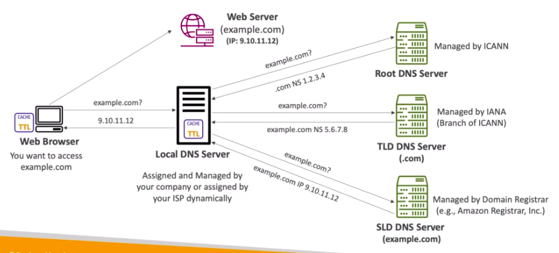

# **What is DNS?**

* Domain Name System which translates the human friednly hostnames into the machine IP address.
* www.google.com => 172.217.18.36
* DNS is thebackbone of the internet.
* DNS uses a hierarchical naming structure:
    * .com
    * example.com
    * www.example.com
    * api.example.com

## **DNS Terminologies.**

* **Domain Registrat** - AWS Route 53, GoDaddy etc.
* **DNS Records** - A, AAAA, CNAME, NS etc.
* **Zone File** - contains DNS records.
* **Name Server** - resolves DNS queries (authoritative or non-authoritative).
* **Top Level Domain (TLD)** - .com, .us, .in, .gov, .org etc.
* **Second Level Domain (SLD)** - amazon.com, google.com etc.

The below outlines this pretty well:

## **How does DNS work?**

The below graphic helps us better explain how our local web client tries to access a webserver named "example.com" at IP address "9.10.11.12"...

