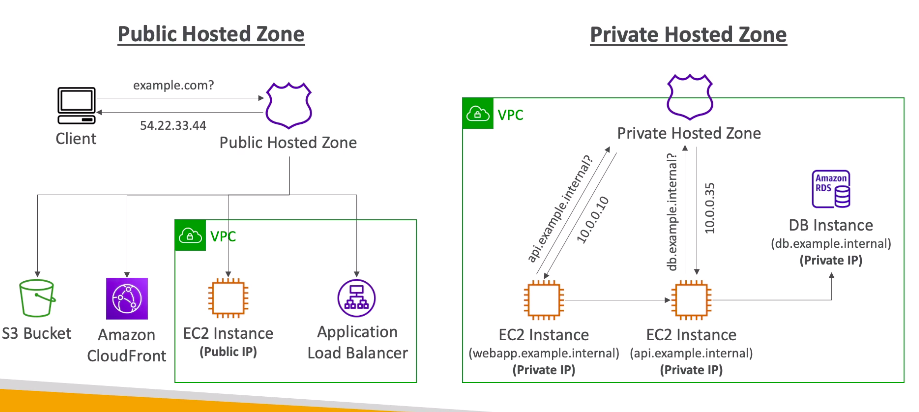

# **Route 53.**

AWS Route 53 is:

* A highly available, scalable, fully managed & authoritative DNS service.
    * Authoritative means that the customer (you) can update the DNS records.
* Let's say we have an EC2 instance hosting our website with a public IP. By inputting DNS records into Route 53 we can assign things such as a Domain Name to our website or app.
* Route 53 is a Domain Registrar.
* Ability to check the health of your resources.
* The only AWS service which provides 100% availability.
* Why Route 53? 53 is a reference to the traditional DNS port.

## **Records.**

* How you want to route traffic for a specific domain.
* Each record contains:
    * **Domain/SubDomain Name** - example.com.
    * **Record Type** - A, AAAA, CNAME, NS.
    * **Value** - 12.34.56.78.
    * **Routing Policy** - how Route 53 responds to queries.
    * **TTL** - amount of time the record is cached at DNS Resolvers.
* Route 53 supports the following DNS record types:
    * A, AAAA, CNAME, NS (must know).
    * CAA, DS, MX, NAPTR, PTR, SOA, TXT, SPF, SRV (advanced).

## **Record Types.**

* A - maps a hostname into IPv4.
* AAAA - maps a hostname to IPv6.
* CNAME - maps a hostname into another hostname.
    * The target is a domain name which must have an A or AAAA record.
    * Can't create a CNAME record for the top node of a DNS namespace (Zone Apex).
    * e.g. you can't create for example.com, but you can create for www.example.com.
* NS - Name Servers for the Hosted Zone.
    * Control how traffic is routed for a domain.

## **Hosted Zones.**

* A container for records that define how to route traffic to a domain and its subdomains.
* **Public Hosted Zones** - contains records that specify how to route traffic on the internet (public domain names). e.g. "application1.mypublicdomain.com".
* **Private Hosted Zones** - contain records that specify how you route traffic within one or more VPCs (private domain names). e.g. "application1.company.internal".
* You pay $0.50 per month per hosted zone.

## **Public vs Private Hosted Zones.**

