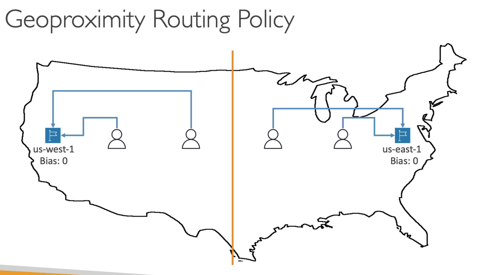
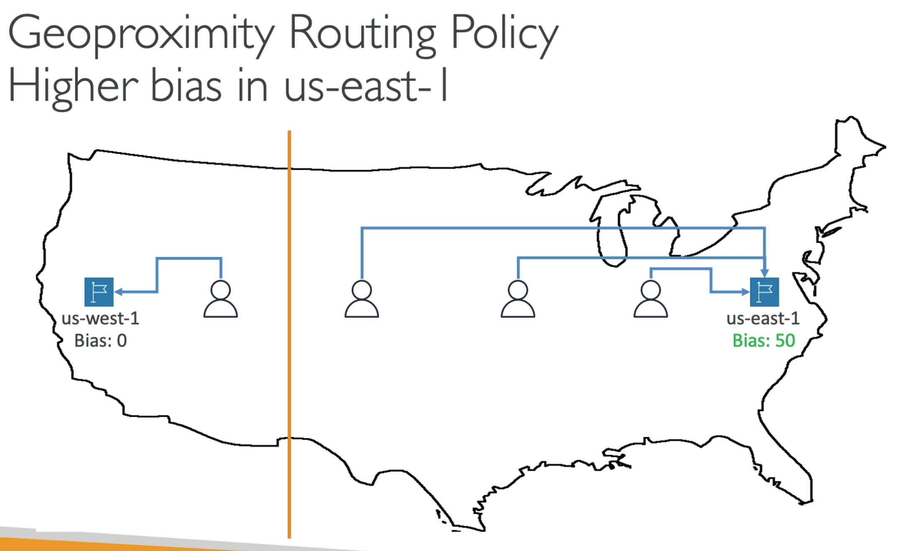

# **Routing Policies.**

* Used to define how Route 53 responds to DNS queries.
* We need to not get confused by the word "Routing":
    * It's not the same as Load Balancer routing which routes traffic to EC2 instances.
    * DNS does not route any traffic, it only responds to DNS queries, this is what we route.
* Route 53 supports the following Routing Policies:
    * Simple.
    * Weighted.
    * Failover.
    * Latency Based.
    * Geolocation.
    * Multi-Value Answer.
    * Geoproximity (using the Route 53 Traffic Flow feature).

## **Simple Routing Policy.**

* Typically, we only route traffic to a single resource.
* Can specify multiple values in the same record.
* If multiple values are returned, a random one is chosen by the **client**.
* When Alias is enabled, specify only one AWS resource.
* Can't be associated with Health Checks.

## **Weighted Routing Policy.**

* Control the % of the requests that go to each specific resource.
* i.e. we can assign 70% of routing traffic to one record, 20% to another and the final 10% to another.
* Assign each record a relative weight.
    * traffic (%) = weight of specific record / sum of all weights of records.
* DNS records must have the same name and type.
* Can be associated with health checks.
* Use cases include:
    * Load balancing between regions.
    * Testing new application versions.
* **We can assign a weight of 0 to a record to stop sending traffic to a specific resource.**

**Below is a useful snippet out-lining the difference between Route 53 weighted DNS routing and an Elastic Load Balancer (ELB) as, on the surface, they look very similar in what they do.**

*"ELB distributes traffic among Multiple Availability Zone but not to multiple Regions. Route53 can distribute traffic among multiple Regions. In short, ELBs are intended to load balance across EC2 instances in a single region whereas DNS load-balancing (Route53) is intended to help balance traffic across regions."*

*"Use both Route53 and ELB: Route53 provides integration with ELB. You can use both Route53 and ELB in your AWS infrastructure. If you have AWS resources in multiple regions, you can use Route53 to balance the load among those regions. Inside the region, you can use ELB to load balance among the instances running in various Availability Zones."*

## **Latency-based Routing Policy.**

* Re-direct to the resource that has the least latency closest to us.
* Super helpful when latency for users is a priority.
* **Latency is based on traffic between users and AWS regions.**
* Let's say we deploy our website / application in the US and in Singapore.
* German users may be directed to our resource deployed in the US (if that's the lowest latency) compared to the one deployed in Singapore.
* Latency-based routing policies can also be used in conjunction with health checks (and has fail-over capability).

## **Failover Routing Policies.**

***See section 8.7). after health checks have been covered.***

## **Geolocation Routing Policies.**

* Different from Latency-based.
* **Routing is solely dependent on user location.**
* We can get as granular as routing by continent, country, US state etc. (if there is over-lapping then the most precise location is selected).
* You should always create a "default" location in the event that there is no match or location available.
* Use cases include:
    * Website localisation.
    * Restricting content distribution.
    * Load balancing.
* These records can also be used in conjunction with health checks.

## **Geoproximity Routing Policies.**

* Allows routing of traffic to your resources based on the geographic location of users and resources.
* Gives you the ability to **shift more traffic to resources** based on the defined **bias**.
* To change the size of the geographic region, specify bias values:
    * To expand (1 to 99) - more traffic to the resource.
    * To shrink (-1 to -99) - less traffic to the resource.
* Resources can be:
    * AWS resources (making sure you specify the AWS region).
    * Non-AWS resources (by specifying the latitude and longitude).
* You must use Route 53 Traffic Flow (advanced) to use this feature.
* This is really helpful in shifting traffic from one region or AZ to another by changing the bias.

Below is an example of the Geoproximity routing policy for two AZ's in the US with zero bias.

And here is the same setup with a higher bias in us-east-1.

## **Multi-Value Routing Policies.**

* Used when routing traffic to miltiple resources.
* Route 53 returns multiple values/resources.
* Can be associated with Health Checks (returns values for healthy resources).
* Up to 8 healthy records are returned for each Multi-Value query.
* **Multi-Value is not a substitute for having an ELB.**