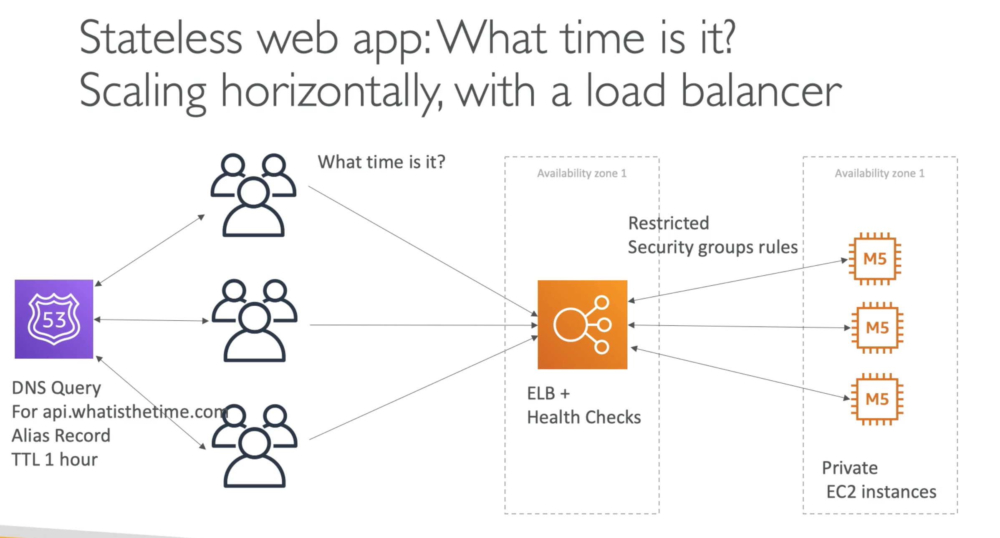
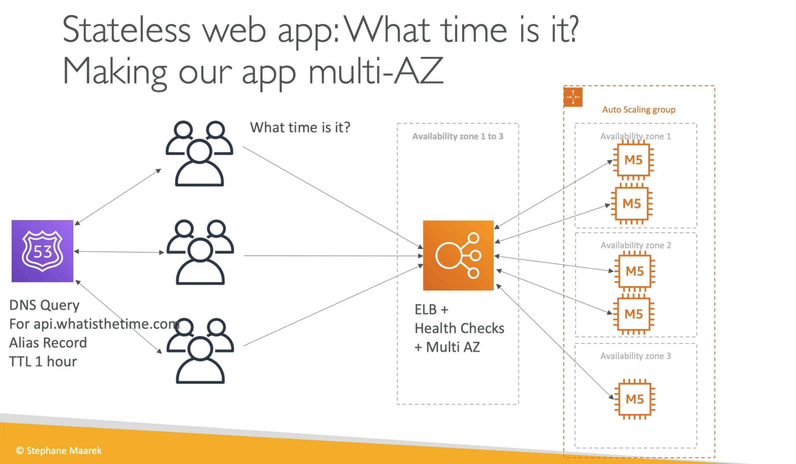

# **Introduction.**

We want to build a stateless web application, named "WhatIsTheTime.com". Here is a bit of background on what we'll want it to do:

* This website will allow people to know what time it is.
* We won't need a database.
* We want to start small and will accept some downtime.
* We want to be able to scale horizontally and vertically if required.

Let's start simple...

Let's envision we have a public EC2 instance (in this case the free T2 micro) that clients can visit and retreive the time. Let's also give the EC2 instance an elastic IP address that will result in a static IP address.

Let's predict some future issues and how we might be able to deal with them...

## **Vertical Scaling.**

What if our T2 micro cannot handle the volume of clients wanting to know the time via our website?

* We can upgrade our instance type to a much larger instance.
* The IP will stay the same due to our elastic IP address.
* However, we will have experienced website downtime due to upgrading the instance.

## **Horizontal Scaling.**

Let's envision that we have our larger instance type running our web application. The website has grown so much that we are still experiencing notable difficulties or problems with the website. Maybe we need to scale out horizontally using  multiple instances with corresponding elastic IP's.

This could work, but it isn't ideal, users would have to know the elastic IP's corresponding to each instance... we need something else:

* Let's remove the elastic IP's on each instance.
* Let's instead create a public hosted zone with Route 53 and enable our users (through DNS querying) to access the IP's.
* Let's create an A record, with a TTL of 1 hour for the domain "api.whatisthetime.com".

**What are the disadvantages of this approach?**

* If we want to remove an instance, users whom have connected to the instance prior with a TTL of 1 hour will experience downtime before they can connect to another of our instances (an hour later).
* This means that there's a possibility that the website can be down for some users and up for others depending on what we do with our instances.

These are problematic, what if we want to scale dynamically by adding or removing instances in conjunction with incoming traffic? Whilst also ensuring no clients experience downtime.

**We need to introduce a load balancer.**

* Let's shift all of our EC2 instances to private instances inside a VPC inside the same AZ (for now).
* Let's also assume we have 3 M5 large instances.
* Let's introduce an **Elastic Load Balancer** that includes health checks on our instances and also includes security group rules (so the instances are restricted/protected).
* Now, our users will still query through our Route 53 hosted zone.
* **However**, our DNS record can no longer be an A record as we are routing directly to the load balancer (an AWS resource), so we will want to set up an **Alias** record instead.

Our architecture now looks like the below, and is starting to look a lot more robust.

However, adding and removing EC2 instances from our VPC is still very manual and time-consuming. Why don't we introduce an **auto-scaling group?**

This will allow our auto-scaling group to scale inwards and outwards based on demand, at 5am in the morning we may only need 1 EC2 instance for our traffic. At midday we may need 3 instances. Our auto-scaling group will manage that.

So now, we have managed to solve:

* Application downtime for users by adding a load balancer with health checks.
* Scaling upwards by introducing a larger instance type to handle to load of the application.
* Scaled outwards by adding more instances to cope with the demand.
* Flexibility to add and remove instances based on said demand.
* Allow users to access our application through one entry-point using our public hosted zone on Route 53.

Can we think of any more issues or problems?

What if AWS in our AZ goes down? Let's increase our availability by making our application multi-AZ.

* We are now going to deploy our Elastic Load Balancer across one region in AZ's 1-3.
* Each of our EC2 instances will now live in their respective AZ's 1-3.

So now, here is our architecture:

Let's push this even further and reserve some EC2 capacity.

We know that two EC2 instances will always be running in two of our AZ's, so let's reserve some capacity to ensure we always have these available.

This may help us save a lot of cost for future running of these instances.

There are 5 pillars to consider when putting together an AWS solution:

* Costs.
* Performance.
* Reliability.
* Security.
* Operational excellence.